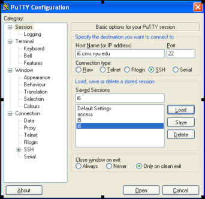
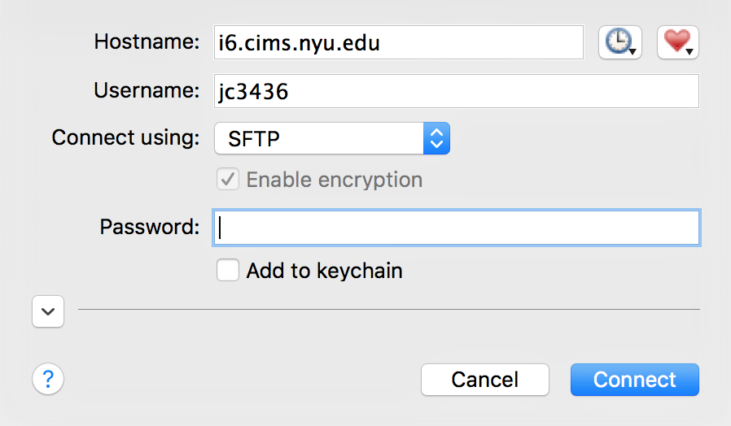

# Unix: Assignment-1

In this assignment you will create a basic Web page and publish it on a Unix server at i6.cims.nyu.edu/~netid.


### Account Information

In order to set up your Web page you need to log in to your i6 account. Here is the information necessary to log in to your account.

Hostname: i6.cims.nyu.edu

Login: *Your NYU NetID*

Password: *The password given to you by Courant*

Your i6 account information was sent to you via email from helpdesk@cims.nyu.edu with the subject, “Welcome to Courant.” If you forget your i6 password and would like to reset it, go to [this page](https://cims.nyu.edu/webapps/content/systems/resources/i6/resetpassword) for instructions on how to do so.

**Web directory: public_html**\
This is the folder on i6 accounts that will serve files to the Web. All HTML and image files should be uploaded into this folder to be viewed on the Web.

**Do not delete public_html**.

Web page address (URL): http://i6.cims.nyu.edu/~netid


### Accessing i6 from the Command Line

Mac and Linux Computers:
Mac and Linux users can use Terminal to access i6 from the command line. Terminal is available in macOS via Applications > Utilities > Terminal.
At the $ prompt, type in the following—substituting netid with your NetID—and press Enter.\
`ssh netid@i6.cims.nyu.edu`

Windows Computers:\
PC users can download and use PuTTY, an SSH and telnet client, to access i6.
Type in the name of the host which, in our case, is i6.cims.nyu.edu; select “SSH” and click “Open.”
For reference, here is a screenshot of a PuTTY Configuration window.\


Your Password:\
Next, enter your i6 password—which is case-sensitive. The cursor does not move as you type your password, but when you press Enter you should be logged in. Take care in typing your password.  **After three unsuccessful attempts you may be locked out for an hour!**

Once logged in, you can change your password by typing `passwd` at the prompt and following the instructions. Basic Unix commands are listed [here](/unix).

If you have problems logging into your i6 account, speak with **ME** as soon as possible.


### Writing Your Webpage

Next, you need to write your page with a text editor. Use [Atom](link: https://atom.io/) or [Brackets](http://brackets.io/) to create a new plain text document. Type or copy and paste the HTML code below into the document. Then enter your name inside the `<title>` tag and a short self introduction inside the `<p>` tag.

```html
<!DOCTYPE html>
<html>
  <head>
    <meta charset="utf-8">
    <title>**Your name goes here**</title>
  </head>
  <body>
    <h1>Intro to Web Design and Computer Principles</h1>
    <p>**Your self introduction goes here**</p>
    <ul>
      <li>HTML</li>
      <li>CSS</li>
      <li>Raster</li>
      <li>Vector</li>
      <li>Layout</li>
      <li>Responsive Design</li>
      <li>Javascript</li>
      <li>Final Project</li>
    </ul>
  </body>
</html>
```

Save this file as “index.html” on your computer. View the page locally in a web browser (File > Open File) to make sure it looks as it should.  You can also just drag this file onto the Chrome/Firefox/Safari icon to open it. This page will serve as a directory for all future assignments.


### Publishing Your Webpage

Next, you will use an FTP client to transfer your “index.html” file from your computer to the i6 server.

Fetch is a Mac FTP client available [from ITS for free](https://www.nyu.edu/its/software/) to NYU students (see the included NYU_licensing.rtf file for the serial number). [Cyberduck](https://www.cyberduck.io) is free and also very easy to use for mac and pc. [WinSCP](http://winscp.net/) is a good, free option for Windows computers. Alternatives include [FileZilla](https://filezilla-project.org/) for Mac, Windows, and Linux. Whatever program you use, be sure to connect to i6 using **SFTP** (as opposed to FTP).

Here is an example of an FTP client’s login screen. Fill it in as follows but with your own NetID and i6 password and connect using “SFTP.” After logging in, you can upload files to the web server and also download files from the server.



Upload the index.html file from your computer to your i6 account in the **public_html** folder. Once you have uploaded the file, check to make sure your Web page is visible at: i6.cims.nyu.edu/~netid


### Setting Permissions

If your page is not visible when you try to access it at i6.cims.nyu.edu/~netid and you get a 403 (Forbidden) error, you may need to change who can access your site by setting its “permissions.”

Log into i6 with Terminal or PuTTY and type the following commands in this order at the Unix system prompt (represented here by the `$` sign). Be sure to type commands exactly as they are written and do not include the `$`.

```
$ cd
$ chmod 755 public_html
$ cd public_html
$ chmod 644 index.html
$ cd
```

Your page should now be accessible to you and the world.


### Submitting Your Assignment

Submit the following via NYU Classes:\
-The URL to your page in the general form of http://i6.cims.nyu.edu/~netid/

-The index.html file, uploaded as an attachment

Please note that you are required to submit files along with URLs in order to receive credit for your work.


### Grading

This assignment is worth 2 points:\
-Studentʼs web page has been set up at the URL they provide. (1 point)\
-Web page has been customized with the student’s name and self introduction. (1 point)
