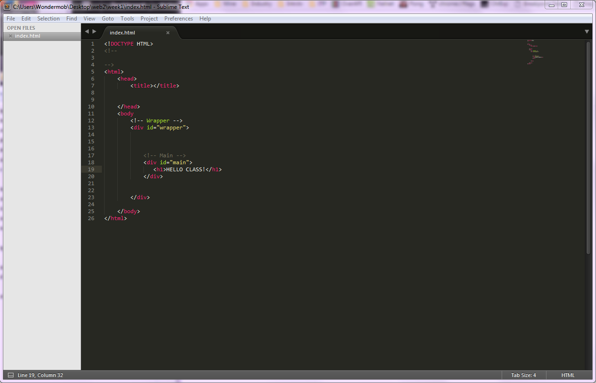
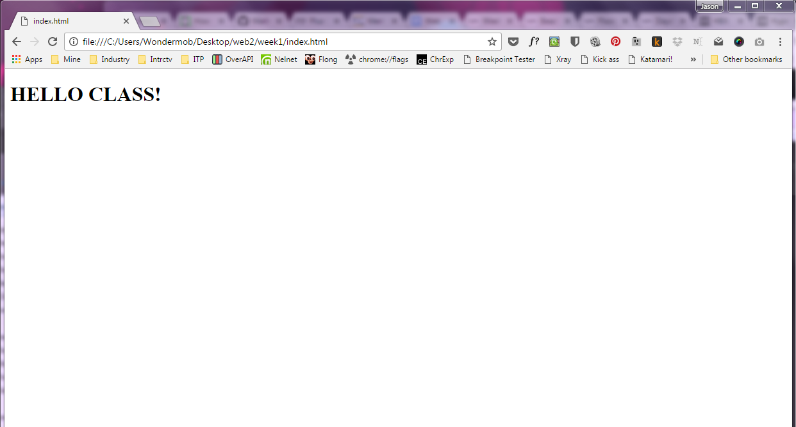
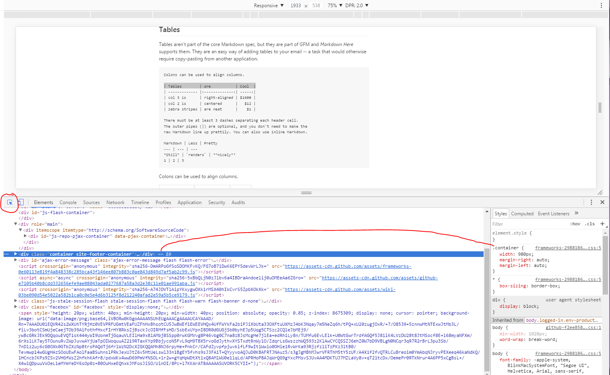

# Working With Local Files

### WORKFLOW SETUP

I see that some of you were unclear as to how Cyberduck/Transmit/Fetch and Sublime/Atom/Brackets interacted with each other and how you interact with it.  

First off, after you have downloaded Cyberduck/Transmit/Fetch and Sublime/Atom/Brackets , you want to create a folder structure on your computer (these are your **local** files) that will mimic the folder structure on your site (those are your **remote** files that live online, on your server, and are visible from a URL).   

|Folder | Structure | For  | Class |
|  ---  |  ---  |  ---  |  ---  |
| public_html → | index.html |||
|   | **assignment1_folder →** |**index.html**||
|   |   |**styles.css**||
|   |   |**assets_folder→**|**image.jpg**|
|   |   |   |**image2.jpg**|
|   | **assignment2_folder →** |**index.html**||
|   |   |**styles.css**||
|   |   |**assets_folder→**|**image.jpg**|
|   |   |   |**image2.jpg**|

This way, you would navigate to your site via a url structure like this for example:  `http://i6.nyu.edu/~jwa241/assignment1_folder`

While you are programming **LOCALLY**, meaning on your computer, you want these two programs open: Sublime/Atom/Brackets and Chrome/Firefox.  The reason why we want Chrome/Firefox is so that we can use the browser's **Development Tools** to aide in programming and manipulating.  When you get a chance, take a look at [Sublime Text tutorial](https://scotch.io/bar-talk/the-complete-visual-guide-to-sublime-text-3-getting-started-and-keyboard-shortcuts text) and [Chrome Dev Tools Tutorial](https://developer.chrome.com/devtools text).  These are invaluable to making your life easier!   

So when you are editing your files in Sublime Text or other text editor, drag the html file you are editing to Chrome to preview your site as you work.  You can keep refreshing the browser as you edit to get an idea of how your project is coming along.  

When you are editing the CSS of your site, its best to try things out using the Chrome Developer Tools with the CSS window open.  This CSS window shows all of the styles you have applied to the current file.  If you inspect an element, it will show you all of the styles you have applied to that element and you can manipulate and change the styles live.   Awesome!

When you are finished, use Cyberduck to connect to your live website (email me if you need help with this) and literally drag and drop your folder in its appropriate location to update all of the files.  You can either replace the entire Web2 folder or just the individual files you have changed.  Be careful that you don't OVERWRITE files you don't want to change.

**Let me know if any of this is unclear and we can go over it in class or individually.**

Also, if you prefer, you can also experiment with the Codepen.io site I showed in class.  You can build and toy around with fully functioning sites from within Codepen.  Make sure you create an account so that your work is saved! BUT, you cannot turn in work on here. It is merely to take advantage of the ease of having mulitple workspaces open on the same screen.
