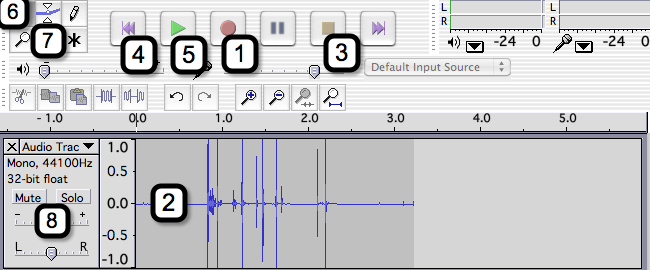

# Week 12: Web Audio and Video, Git Version Control

### Lecture

This week we learn how to add audio and video elements to our page. We will also learn about some programs that will help us optimize (reduce file size with maximum quality) our audio and video files since they tend to be large. We also go over version control with git and github.

[Link to Async Lecture](https://nyu.zoom.us/rec/play/7dLCF4D-gAWcKp7agbLqnTBdsb6OJq0iO1tyg7TdO_3_M7uxerd03i57bozc1NaWPGYYZT6uSVdOM1GB.JtKRUJN4r7mJOFWh)\
[Download JavaScript Events Slides](https://onetimeuser.github.io/intro-web-comp-principles/week-12/Week-12.pdf)\

- how do you write `<audio>` and `<video>` elements
- what are some of the functions of version control

[HTML Audio Element Resources](https://developer.mozilla.org/en-US/docs/Web/HTML/Element/audio)\
[HTML Video Element Resources](https://developer.mozilla.org/en-US/docs/Web/HTML/Element/video)\
[Audacity Open Source Sound Editor](https://www.audacityteam.org/)\
[Handbrake Open Source Video Encoder](https://handbrake.fr/)\
[My Favorite: FFMPEG](https://www.ffmpeg.org/)\
[Check out the class website on github!](https://github.com/OneTimeUser/intro-web-comp-principles)

### Synchronous Zoom

### Assignment
- Learning Web Design\
    Chapter 10: Embedded Media\
    Chapter 20: Modern Web Development Tools

- Go to [Github](https://github.com/) and create a free account if you have not already!

### Audacity QUICK START

1. Open up Audacity. A screen similar to the above will appear.
2. Make sure that you have a microphone installed. You can use the built-in microphone on your laptop if need be, but a USB powered external microphone will really help to make your audio come out crisp and clear.
3. Click on the record button (#1) and begin speaking. A waveform will begin to appear (#2) as your voice is detected by the microphone.
4.  Click on the stop button (#3) in order to stop the recording.
5.  Click the rewind button (#4) and play button (#5) to listen to your recording.
6. To trim your recording make sure that the selection tool is clicked (#6) then highlight the portion of the audio that you would like to cut. Click on Edit > Cut to extract the selected area.
7.  To record a second clip, click the record button (#2) – a second waveform will appear beneath the first.
8.  To reposition a clip, click on the slider tool (#7) and slide the desired clip back and forth.
9.  Using the volume adjustment tool (#8) you can increase or decrease the volume of a specific clip.
10. Your can import other audio files (WAV, MP3) by clicking on Project > Import Audio. The audio file will appear as a new waveform. Here is a small collection of sound effect files to get you started.
11. You can also apply special effects to your audio clips. This can be accomplished by selecting a portion of a clip using the selection tool (#6) and then using the Effect menu.
12. When you are finished working on your clip you should save your project by clicking on File > Save.
14. You can export your project as an MP3 file by clicking on File > Save Other > Export as MP3. Note that Audacity does not come pre-loaded with MP3 export capabilities. You can add this feature into the system by installing the free LAME MP3 Conversion Library.

With your newly created MP3 file you can create a soundtrack to a video, remix a song, or even create your own podcast.
