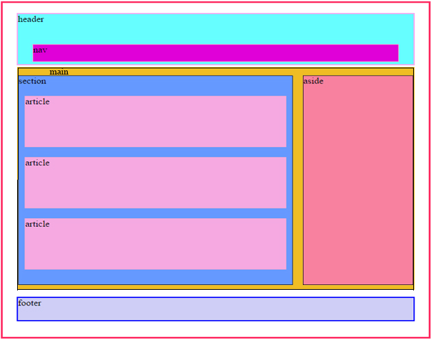

# Week 3: HTML

### Lecture

We continue on with HTML! There's so much here! Take a breath and pace yourself. You will not use everything every time! The following lessons are broken into two parts as a continuation of last weeks lessons. Each lesson as a zip file of what was marked up in that video. It is essentially the same file added onto from the lesson before. Finish one before moving to the next.

- various important elements and what they do
- some elements require attributes to function, namely, `<a>` and ``

### Synchronous Zoom
[Link to Video from Feb 17](https://nyu.zoom.us/rec/share/tkn3MSs058ZJNyy0kI4OB5vL7T4pjdqrJ8in7WQUfXcVModSSxrnPJkIaeXNhvXs.xhN9Ln2fLX9Jr-lz)\
[Feb 17 Project files](https://onetimeuser.github.io/intro-web-comp-principles/week-3/bot-soccer.zip)
The above files include the index file as well as assets folder

#### HTML
We talked about the anchor element: `<a>`which are links!\
What are `
` and `` elements?\
Newly minted HTML5 semantic elements to help us section out our webpage.

[Right Click and 'Save File As' to download zip file](https://onetimeuser.github.io/intro-web-comp-principles/week-3/intro-web-example.zip)\
[Link to Video](https://nyu.zoom.us/rec/play/mIwI7GvjbT7x-pALWIrf2OJbjkZFVPRJaRa0gWDGjZHaApM-FBdKbr7WrmjKE33bz1S7gaCtZtU5I0g.n_8Gkvyd0_OQHmlq)

#### HTML
More `<meta />` Elements, website icons, and site language\
More HTML5 elements: `<figure>`,`<main>`,`<aside>`\
`<!--And comments! Commenting is fun-->`\
Finally...TABLES and everything that makes up a table!

[Right Click and 'Save File As' to download zip file](https://onetimeuser.github.io/intro-web-comp-principles/week-3/intro-web-example-part2.zip)\
[Link to Video](https://nyu.zoom.us/rec/play/0EpWPst-ZESdRakdpd46xy1_QhzOGev4PP1LcIk8cR5aIddoL5NbpKptjAtwyPWrIxh1I5s51wlxILyP.9orzBXhlCNR7L1lj)

Here is a snapshot of a basic layout of a smart HTML5 semantic page:

- READ Learning Web Design\
    Chapter 12: Formatting Text

#### Follow Up
In the previous videos, I admit that my directory was looking pretty filthy so I recorded a quick follow up to show you how I reorganized everything and rechecked my documents to fix links that would be broken.

[Right Click and 'Save File As' to download zip file](https://onetimeuser.github.io/intro-web-comp-principles/week-3/intro-web-cleaned.zip)\
[Link to Video](https://nyu.zoom.us/rec/share/qM2weLVHhxSFl7ceGOyGF6_IhlT3EWVKCE1PZzzZS7xeq7I6MarsIVq7UBLOEa4O.McIsZr27d4-ih1Pt)
